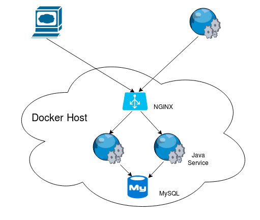
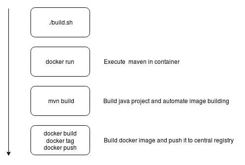
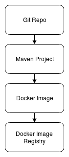
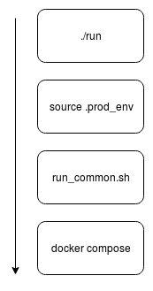

# Project overview

# Requirements

##Setup Docker

### Install Docker
<code>sudo apt-get install docker</code>

<code>sudo apt-get install docker-compose</code>

<code>sudo usermod -a -G docker user</code>

logoff

### Setup hostname

<code>ifconfig</code>

Find Docker's host IP
<pre>docker0   Link encap:Ethernet  HWaddr 02:42:86:71:c8:ed  
          inet addr:<b>172.17.0.1</b>  Bcast:0.0.0.0  Mask:255.255.0.0
          inet6 addr: fe80::42:86ff:fe71:c8ed/64 Scope:Link
          UP BROADCAST RUNNING MULTICAST  MTU:1500  Metric:1
          RX packets:45 errors:0 dropped:0 overruns:0 frame:0
          TX packets:150 errors:0 dropped:0 overruns:0 carrier:0
          collisions:0 txqueuelen:0 
          RX bytes:3184 (3.1 KB)  TX bytes:17494 (17.4 KB)

</pre>

Add hostname entry in /etc/hosts for Docker ip, will be used to contact the registry by hostname
<pre>
172.17.0.1	docker
</pre>

### Allow access of insecure (non https) repositories
Create /etc/docker/daemon.json
<pre> { "insecure-registries":["docker:5000"] }</pre>

Restart Docker

<code>sudo systemctl restart docker</code>

## Install Docker registry
### Run

<code>docker run -d -p 5000:5000 --name registry registry:2</code>

### Documentation
https://docs.docker.com/registry/

## Checkout project
<code>git clone https://github.com/rendz/docker.git</code>

## Build project

<code>cd docker/simpleservice/

<code>./build</code>
<code>docker images</code>

<pre>REPOSITORY                            TAG                 IMAGE ID            CREATED             SIZE
docker:5000/fortune-service           latest              7bebedccf5de        46 hours ago        130MB</pre>

## Run project

<code>./debug</code>

### Debug

Starts one instance of the Java service accessible on port 8080 with debug port open - 5005

### Run in "production" like mode

Starts 2 instances of the Java service accessible on port 80

## Fortune Service API

Get latest fortune

<code>curl localhost:8080/fortune/latest</code>

Insert new fortune

<code>echo {\"fortune\": \"Some text to insert"} | curl -H "Content-Type: application/json" -X POST -d @- http://localhost:8080/fortune</code>